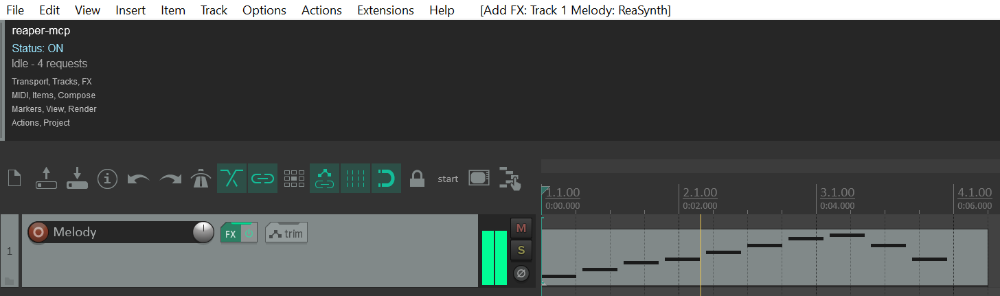

# dawmcp

[](https://github.com/vecnode/dawmcp/actions/workflows/ci.yml)
[](LICENSE)

A comprehensive MCP for Digital Audio Workstations (DAWs) - not just one.

It connects Claude to a live, running DAW instance - controlling transport,
tracks, FX, and rendering - through a DAW-agnostic tool surface, with a
per-DAW adapter behind it. REAPER is the first adapter (full tool parity);
Audacity is next.



## Architecture

```
Claude  <--stdio-->  dawmcp (Rust, rmcp)  -->  DawBackend trait  -->  per-DAW adapter
                                                                       |
                                                          adapters/reaper  (file IPC --> reaper_bridge.lua --> reaper.* API)
                                                          adapters/audacity (planned: mod-script-pipe)
```

`dawmcp-core` defines DAW-agnostic traits (`Transport`, `Tracks`, `Fx`,
`Render`, `Project`, `Status`) so the same MCP tools work over any DAW that
implements them. DAW-specific concepts that don't generalize (REAPER's
`run_reascript` escape hatch, Audacity's label tracks) live only in that
adapter, not in the shared core.

The REAPER adapter (`crates/dawmcp-reaper`) talks to REAPER the same way the
original Python implementation did: the server writes one JSON request file
per call into a bridge directory, `lua/reaper_bridge.lua` picks it up on its
next `reaper.defer()` tick (REAPER's UI frame rate, ~16-33ms round trip) and
writes a JSON response back - no REAPER extensions required. See
[docs/ARCHITECTURE.md](docs/ARCHITECTURE.md) for the full design writeup and
why this is file IPC rather than a socket.

## Status

The Rust workspace (`dawmcp-core`, `dawmcp-server`, `dawmcp-reaper`) has full
REAPER tool parity with the original Python implementation, verified against
a real running REAPER instance (the Python package has been removed; `git
log` has its history). `dawmcp-audacity` exists as a scaffold - its
`mod-script-pipe` wire protocol works and is verified against Audacity's own
reference client, but most tools return "not yet implemented" pending
verification of exact command parameters, and it isn't wired into the
server binary yet. See [AGENTS.md](AGENTS.md) for specifics.

## Requirements

- [Rust](https://rustup.rs/) (stable toolchain, via `rustup`)
- REAPER (tested on 6.x/7.x) for the REAPER adapter - nothing else, no
  REAPER extensions to install.

## Setup

1. Build the server:
   ```
   cargo build --release
   ```
2. Point Claude Code (or Claude Desktop) at it. Example `.mcp.json` /
   `claude_desktop_config.json` entry:
   ```json
   {
     "mcpServers": {
       "reaper": {
         "command": "<path-to-this-repo>/target/release/dawmcp"
       }
     }
   }
   ```
   That's it - on every launch, `dawmcp` auto-detects and installs
   `lua/reaper_bridge.lua` (plus the default project and startup hook, see
   below) into every REAPER install it finds, idempotently, before serving.
   No separate setup script or manual Actions-list step needed. Pass
   `--no-install` to skip this and just serve.
3. If REAPER is **already open** when `dawmcp` first installs the startup
   hook, it won't retroactively start the bridge this session - either fully
   quit and reopen REAPER, or load it once manually: **Actions -> Show
   action list -> New action -> Load ReaScript...**, select
   `reaper_bridge.lua`, then **Run** it. You should see the small status
   window appear (see "Status window" below).

Useful standalone commands (no MCP client needed):
```
dawmcp --status         # diagnostics: REAPER installs found? bridge heartbeat fresh?
dawmcp --install-bridge # install/update the bridge for every detected REAPER, then exit
```

If a tool call errors with "bridge heartbeat not found or stale", the bridge
script isn't currently running in REAPER (REAPER was closed, the script was
stopped, or it crashed) - reload/rerun it via the Actions list. Call the
`daw_status` tool for diagnostics.

## Default project

[reaper_project/default.RPP](reaper_project/default.RPP) is a blank,
track-less project checked into this repo (generated by REAPER itself, not
hand-authored, so its file format is guaranteed valid). `dawmcp` copies it
into REAPER's resource path as `reaper-mcp-default.RPP` and adds a
`reaper.Main_openProject(...)` call to the same `__startup.lua` block that
installs the bridge, so REAPER opens this clean project automatically on
every launch instead of whatever it would otherwise default to.

## Status window

Once the bridge is running, a small status window appears in REAPER,
**docked by default** (not floating). It shows:
- **"Status: ON"** - the bridge has no on/off toggle; once loaded it runs for
  as long as REAPER is open, independent of whether this window is open
- Green **"Active"** if a request was processed in the last ~3 seconds, gray
  **"Idle"** otherwise, plus a running request count
- A quick reference list of available tool domains

## Tool overview

DAW-agnostic tools (`dawmcp-core`'s `DawBackend` trait), backed by whichever
adapter is active - REAPER today:

| Domain | Tools |
|---|---|
| Status | `daw_status` |
| Transport | `transport_play/stop/pause/record/seek/set_tempo/get_state` |
| Tracks | `track_add/remove/rename/set_volume_db/set_pan/set_mute/set_solo/set_color/list` - `-1` as `track_index` means the master bus, everywhere a track-taking tool accepts one |
| FX | `fx_add/remove/set_enabled/list/set_param/get_param` |
| Render | `render_project(output_path, start_seconds, end_seconds, overwrite)` |
| Project | `project_save`, `project_undo` |

REAPER-only tools (no cross-DAW equivalent, exposed via `dawmcp-reaper`'s
inherent methods rather than the shared trait):

| Domain | Tools |
|---|---|
| MIDI | `midi_add_item`, `midi_add_note` |
| Items | `item_split/move/glue_selected/render_in_place_selected` |
| Markers | `marker_add`, `region_add` |
| View | `view_zoom_to_selection`, `view_scroll_to`, `view_set_arrange_zoom` |
| Actions | `action_run(command_id)`, `action_get_toggle_state(command_id)` |
| Compose | `compose_and_render(output_path, notes, track_name)` - one call: new track + MIDI notes + render to audio |
| Escape hatch | `run_reascript(code)` - arbitrary ReaScript Lua |

See [AGENTS.md](AGENTS.md) for the up-to-date next-steps list (Audacity
adapter, `cargo clippy` in CI, cross-platform verification, etc.).

## Development

```
cargo build
cargo test --workspace
```

## License

Licensed under the [MIT License](LICENSE).
